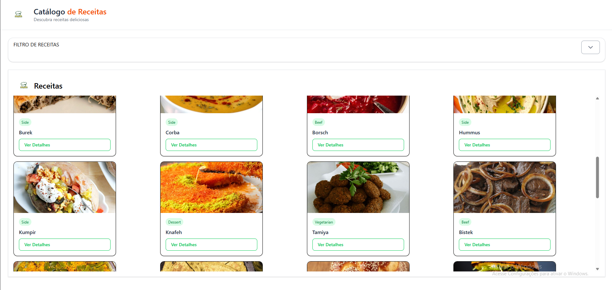
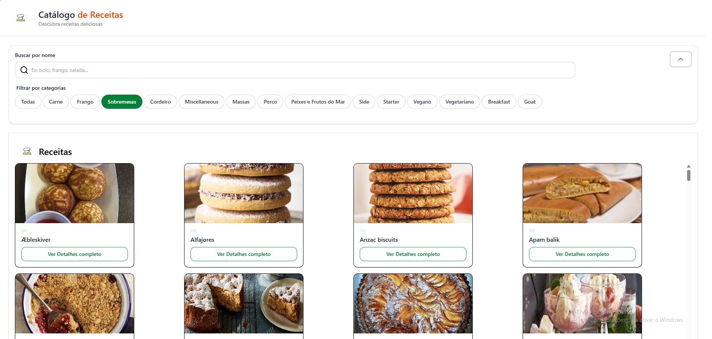
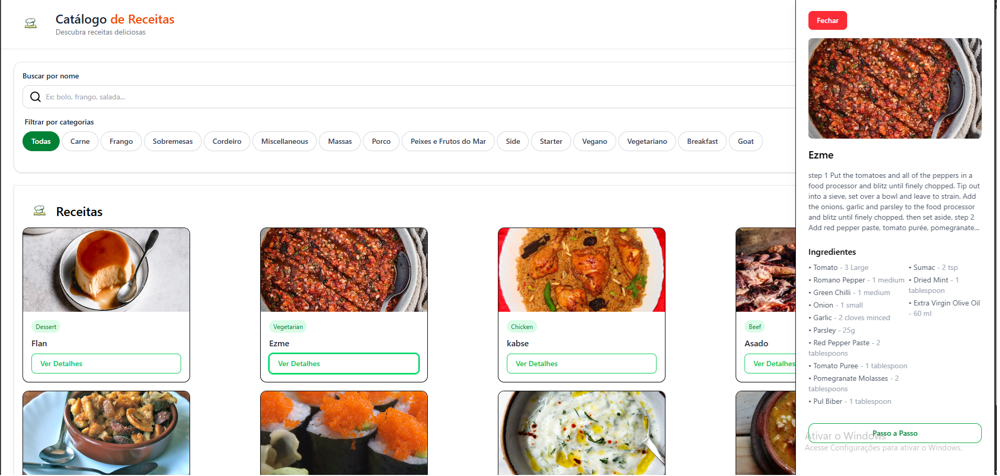
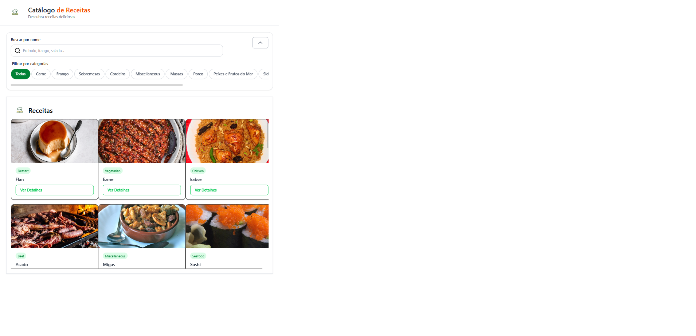
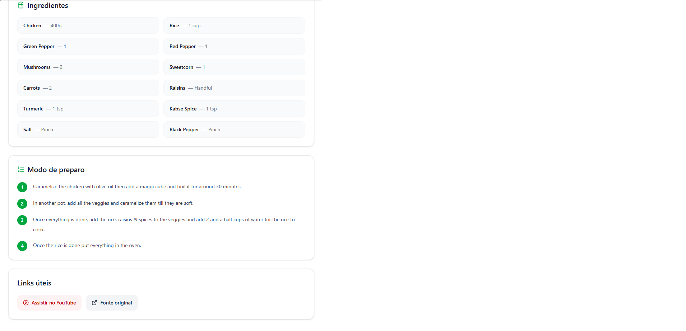
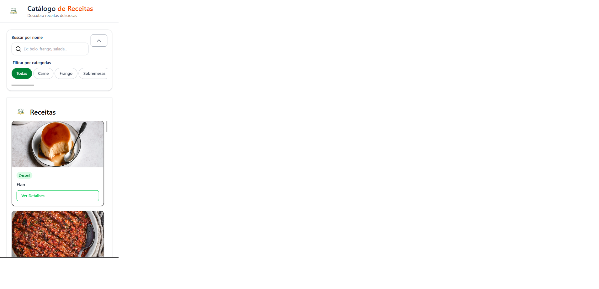
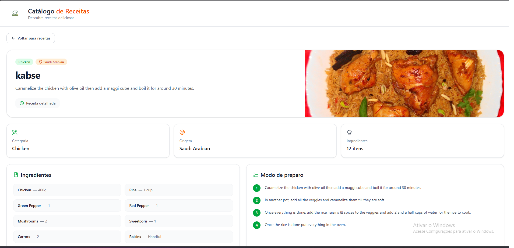
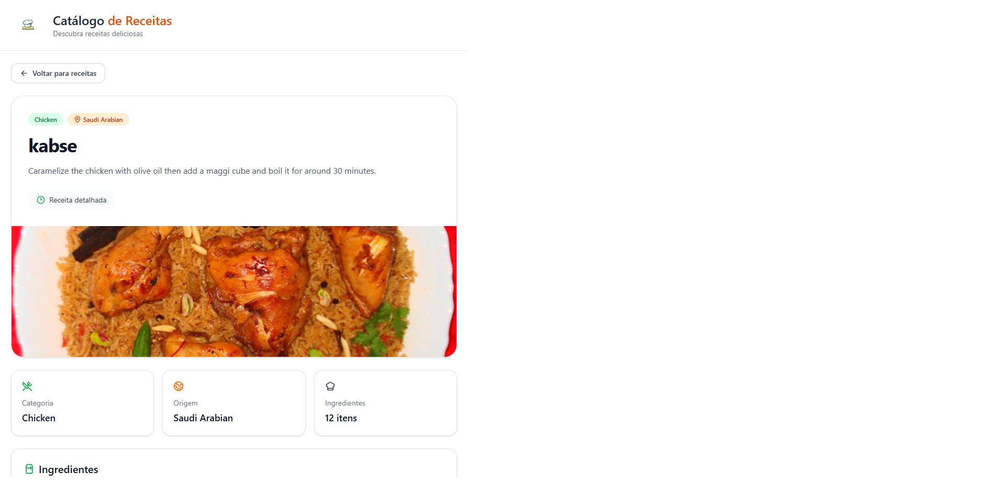
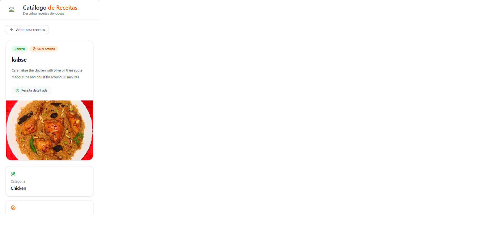

# Desafio 3 — Explorador de Receitas

## Visão geral

Neste desafio, você irá construir uma aplicação com múltiplas páginas que consome dados da API **TheMealDB**.

O objetivo é permitir que o usuário explore receitas e visualize detalhes de cada uma.

A aplicação deve incluir navegação entre páginas, consumo de API e renderização dinâmica de conteúdo.

DEPLOY PARA ANALISE:
https://desafio-3-livro-de-receitas-three.vercel.app/

LISTA DE RECEITAS

VERSÃO DESKTOP

  

  

  

VERSÃO TABLET

  

  

VERSÃO MOBILE

  

DETALHES DA RECEITA
VERSÃO DESKTOP

  

VERSÃO TABLET

  

  

VERSÃO MOBILE

  

